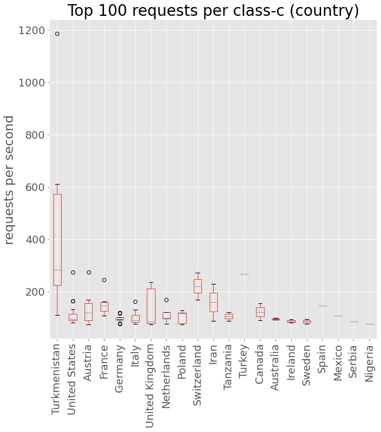

# 2020-09-21 DoS from Turkmenistan

On the 21th of September of 2020, our adfree DoH service faced an immediate spike in requests with **a peak of 800K requests per hour** \(26 times our average request load at this time\). The amount of requests led to service interruptions of several hours and our public adfree services became unresponsive during the attack. An adhoc analysis and mitigation showed that our DoH service where potentially hit by a DDoS attack from Turkmenistan.


### Request rates per unique IPv4 address <a id="Request-rates-per-unique-IPv4-address"></a>

The mean request rate for a representative set of 3,9 million DoH requests we analyzed, showed that clients had a **mean rate of 2.6 DoH requests per second**. We observed request rates **up to 571 requests per second** from the attackers network range.

```text
Analyzed 3911891.0 requests.

requests_per_sec  mean      2.6
                  std       4.9
                  min       0.0
                  25%       1.0
                  50%       2.0
                  75%       2.0
                  max     571.0
```

### Requests rate per class-c network / country <a id="Requests-rate-per-class-c-network-/-country"></a>

For a split second one might have thought that the Usable Privacy DNS services all of a sudden became popular in Turkmenistan \(maybe the "slashdot" effect, who knows ...\). It however became clear that the source of the steep surge in requests originated from handful of class-c network ranges. e.g. **one particular class-c network from Turkmenistan was responsible for almost 1,200 requests per second**. Requests per class-c network for all other countries than Turkmenistan were below 255 requests per second.



